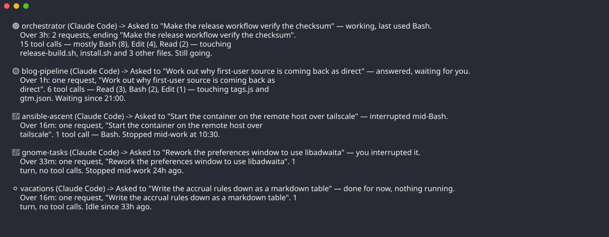

# recap — what were my agents doing?

You left several coding agents running across several repos, closed the laptop, and came
back. `recap` is the one command that answers "what were they doing, and is anything still
going?" — a few lines of output, no interaction, no daemon, and (unless you ask for
`--smart`) no network.



*(Real output from the real binary. The sessions are made up — `tools/screenshot.sh` builds
a throwaway store rather than publishing anyone's actual project names. The 🟢 and 🟡 lines
are genuine liveness detection against real processes.)*

recap is a *reader*. It parses what the agents already write to disk and never writes to
their state directories, so it cannot corrupt a session in progress and needs no hooks, no
daemon and no cooperation from the agents.

Supported agents:

| Agent | Store |
|---|---|
| Claude Code | `~/.claude/projects/<escaped-cwd>/<session-id>.jsonl` |
| opencode (1.18+) | `~/.local/share/opencode/opencode.db` |

## Install

```sh
nix build          # ./result/bin/recap
nix run . -- --help
```

Or with a Go toolchain: `go build ./cmd/recap`.

## Usage

```
recap                    # what happened in the last 24 hours
recap --all              # ignore the time window
recap --running          # only what is working right now
recap -v                 # a line per session under each project
recap --json             # the same data, machine-readable
recap --legend           # what the icons mean
recap --smart            # have a model write the sentences instead
```

One line per project, most recently active first:

```
<icon> <project> (<agent>) -> <one-sentence recap>
```

Several sessions in one directory collapse into one line, and the busiest of them decides
what that line says — a project with something still running is never reported as idle.
`-v` breaks it back out into a line per session.

### Flags

| Flag | Meaning |
|---|---|
| `--since <duration>` | hide sessions untouched for longer than this (default `24h`; understands `90m`, `2d`) |
| `--all` | ignore the time window |
| `--agent claude\|opencode` | only one agent's sessions |
| `--project <name>` | only this project |
| `--running` | only projects with something running right now |
| `--root <dir>` | only projects under this directory (repeatable; default: your home) |
| `-v`, `--verbose` | a line per session: id, age, model, last tool, last file, branch |
| `--json` | the machine-readable report |
| `--no-icons` | status words instead of emoji, for terminals that mangle them |
| `--legend` | print the status vocabulary |
| `--config <path>` | use this config file |
| `--no-cache` | re-read every transcript instead of using `~/.cache/recap` |
| `--smart` | have a model write the sentences (see below) |

## What the icons mean

Every status has a rule behind it, so the icon is a fact rather than a vibe:

| Icon | Word | When |
|---|---|---|
| 🟢 | running | an agent process is attached to that directory and the transcript grew in the last 90 seconds, or is mid-turn |
| 🟡 | waiting | the process is alive and the last thing in the transcript is the agent's: an answer, a question, or a permission prompt it is sitting on |
| ⚪ | idle | no process, and the session stopped at an ordinary point |
| 🔴 | interrupted | no process, and the transcript ends mid-work — a tool call with no result, or an interrupt marker. The closed-the-laptop case |
| ✅ | finished | the session ended after explicitly completing what it was asked |
| ❓ | unclear | recap could not tell: an unreadable transcript, or no way to check what is running |

Two deliberate refusals:

- **✅ is never inferred.** Without a model there is no reliable "the task was done" signal,
  so ✅ is reserved for an explicit marker the agent left (opencode's archived sessions).
  Everything else that stopped tidily is ⚪.
- **❓ is not a synonym for ⚪.** If recap cannot read the process table, or a transcript
  makes no sense, it says so rather than reporting a confident "idle".

Liveness comes from the process table: an agent is recognised by its `argv[0]` and matched
to a session by working directory. Claude Code's command line does not carry a session id,
so a project with two live sessions in the same directory cannot be told apart at that
level of detail — the project line is still right. Where the process table is unreadable,
statuses degrade to recency and `--json` says `"liveness": "unavailable"`.

## Config file

Optional, at `~/.config/recap/config.toml` (or `$XDG_CONFIG_HOME/recap/config.toml`).
**Command-line flags always win over the file.**

```toml
since  = "12h"                       # default time window
roots  = ["~/git", "~/work"]         # only report projects under these
ignore = ["~/git/scratch"]           # ...except these
icons  = true                        # false is the same as always passing --no-icons
smart_model = "claude-sonnet-5"      # which model --smart asks

[icon]                               # override individual glyphs
running     = "▶"
waiting     = "?"
idle        = "·"
interrupted = "!"
finished    = "✓"
unclear     = "~"
```

The file is parsed strictly: an unknown setting or a malformed line stops recap with the
file and line number, because a setting that silently does not take effect is worse than no
config file at all.

## `--json`

The JSON is a public interface — the `recap-gs` GNOME Shell extension consumes it — so it
carries a schema version and is always a document, even when there is nothing to report.

```json
{
  "version": 1,
  "generated_at": "2026-08-09T18:50:00Z",
  "liveness": "process-table",
  "projects": [
    {
      "name": "orchestrator",
      "dir": "/home/user/git/orchestrator",
      "status": "running",
      "icon": "🟢",
      "recap": "Asked to \"Run the whole benchmark suite\" — working, last used Bash.",
      "agents": ["Claude Code"],
      "last_activity": "2026-08-09T18:49:55Z",
      "sessions": [
        {
          "id": "aaaa1111",
          "agent": "Claude Code",
          "status": "running",
          "icon": "🟢",
          "recap": "Asked to \"Run the whole benchmark suite\" — working, last used Bash.",
          "dir": "/home/user/git/orchestrator",
          "branch": "main",
          "model": "claude-opus-5",
          "agent_version": "2.1.226",
          "started": "2026-08-09T18:35:00Z",
          "last_activity": "2026-08-09T18:49:55Z",
          "last_tool": "Bash",
          "last_file": "/home/user/git/orchestrator/Makefile",
          "source": "/home/user/.claude/projects/-home-user-git-orchestrator/aaaa1111.jsonl"
        }
      ]
    }
  ]
}
```

Guarantees for consumers of version 1:

- `version` is present and is an integer. If it is not one you know, say so rather than
  guessing at the shape.
- `projects` and `sessions` are always lists, never `null`.
- `status` is one of `running`, `waiting`, `idle`, `interrupted`, `finished`, `unclear`.
- `liveness` is `process-table` or `unavailable`. When it is `unavailable`, an `unclear`
  status means "recap could not check", not "the session is odd".
- Fields marked optional in the example (`title`, `branch`, `model`, `last_tool`,
  `last_file`, `todo_done`, `todo_total`, `unreadable`) may be absent.

## `--smart`

The sentences are assembled from the transcript by plain logic, which is instant, free and
offline, but blunt. `--smart` has a model write them instead:

```sh
export ANTHROPIC_API_KEY=...
recap --smart
```

What this does and does not do:

- **It sends a short summary of each project** — name, agent, status, the last request and
  the agent's last message (both clipped to 300 characters), the last tool, progress counts,
  an age, and the sentence recap wrote itself. That is the whole list, and a test pins it.
  No file contents, no tool output, no transcript, no paths into your store.
- **It never withholds the report.** No key, no network, a rate limit, a reply recap cannot
  parse: it says so on stderr and prints the plain sentences.
- **It does not spawn an agent.** It is one HTTPS call to the Messages API, not a
  `claude -p` subprocess — running an agent to describe your agents would write a new
  session into the very store recap reads.
- One request covers the whole report, so `--smart` costs one call regardless of how many
  projects you have.

The model defaults to `claude-sonnet-5`; `smart_model` in the config file changes it.

## Speed and privacy

- **Fast**: 156 ms cold and 11 ms warm across 25 projects on the machine it was built on,
  against a 300 ms target. Transcripts reach tens of megabytes, so recap reads only the tail
  of each, and caches what it parsed under `~/.cache/recap`, keyed on file size and mtime.
- **Side-effect free**: recap never writes to an agent's directories and never starts an
  agent. It uses the network only for `--smart`, which is opt-in.
- **Local**: it reads only the current user's own files and prints only short summaries.
  Nothing leaves the machine unless you pass `--smart`, and then only the facts listed
  above.
  Transcripts contain source code and sometimes secrets; the fixtures in this repo are
  scrubbed before being committed (`tools/scrub-*-fixture.py`), and the screenshot is taken
  against made-up data.

## Development

```sh
nix develop           # go, gopls, sqlite, jq, python3, charm-freeze
go test ./...
go build ./cmd/recap
tools/screenshot.sh   # regenerate screenshots/recap.svg
```

CI (`.github/workflows/ci-recap.yml`) runs `nix flake check`, which builds the binary, runs
`go test ./...` and enforces `gofmt`. To reproduce it exactly:

```sh
nix flake check --print-build-logs
```

A flake only sees git-tracked files: `git add` new files before running it.

`docs/session-formats.md` is the write-up of both on-disk formats — what recap keys on,
which fields are reliable, and what would invalidate the status rules. Read it first if a
new agent release breaks something.

## Language

Go, chosen because the answer to "what language?" in `PLAN.md` answered a different
question. It gives a single binary with a sub-100 ms start, which the speed target needs,
and it is straightforward for `recap-gs` to shell out to for `--json`. The only dependency
is a pure-Go SQLite driver, for reading opencode's store.
